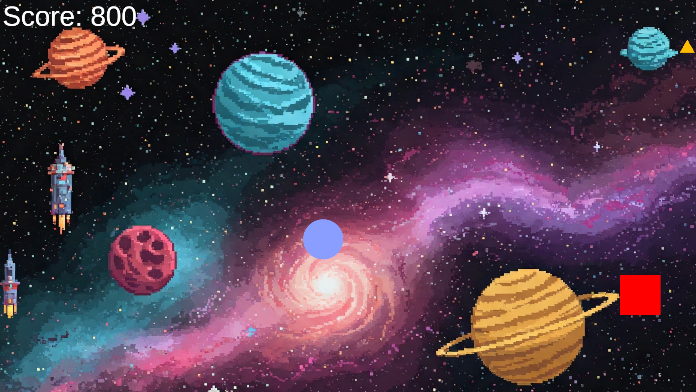

ゲーム制作技術総合実習 個人ワーク
（Circle, Triangle, Squareを使用した2Dゲーム）

# SQUAREBUSTER

## ゲームの内容
プレイヤーは〇で迫ってくる▢を倒して、できるだけ長い間生き残るゲームです。▢を倒すごとにスコアが加算されていき、
最終的にスコアをより稼ぐことを目的としています。

## 操作説明
- 矢印キー、若しくはAWDSキーでプレイヤーの移動
- マウスカーソルでエイム。クリックorマウス左ボタン長押しで射撃。
